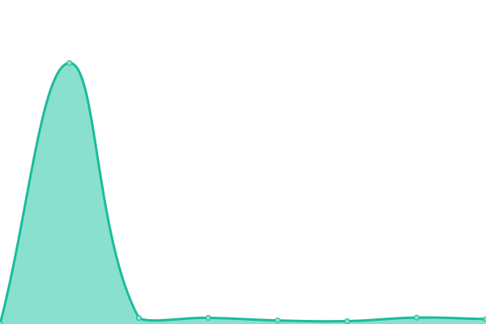
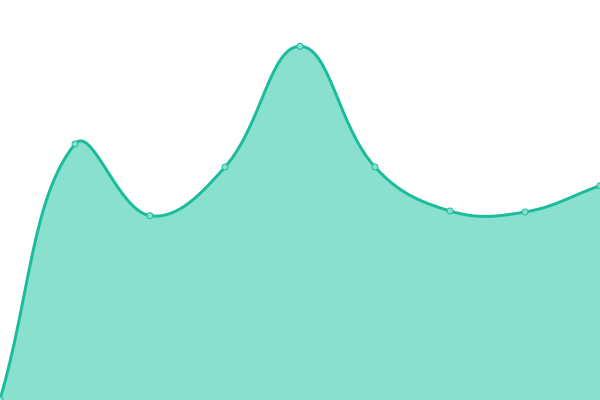

# [📈 Live Status](https://repl.co): <!--live status--> **🟧 Partial outage**

This repository contains the open-source uptime monitor and status page for [auteen](https://repl.co), powered by [Upptime](https://github.com/upptime/upptime).

With [Upptime](https://upptime.js.org), you can get your own unlimited and free uptime monitor and status page, powered entirely by a GitHub repository. We use [Issues](https://github.com/auteen/upptime/issues) as incident reports, [Actions](https://github.com/auteen/upptime/actions) as uptime monitors, and [Pages](https://repl.co) for the status page.

<!--start: status pages-->
<!-- This summary is generated by Upptime (https://github.com/upptime/upptime) -->
<!-- Do not edit this manually, your changes will be overwritten -->
<!-- prettier-ignore -->
| URL | Status | History | Response Time | Uptime |
| --- | ------ | ------- | ------------- | ------ |
|  [repl.co](https://hello-repl.auteen.repl.co) | 🟩 Up | [repl-co.yml](https://github.com/auteen/autoreplit/commits/HEAD/history/repl-co.yml) | 

 1541ms
     
 | 

<a href="https://auteen.github.io/autoreplit/history/repl-co">99.70%</a>
    

|  [replTrojan](https://replit-trojan.auteen.repl.co) | 🟥 Down | [repl-trojan.yml](https://github.com/auteen/autoreplit/commits/HEAD/history/repl-trojan.yml) | 

 750ms
     
 | 

<a href="https://auteen.github.io/autoreplit/history/repl-trojan">0.00%</a>
    

|  [vlessray](https://vlessray.auteen.repl.co) | 🟥 Down | [vlessray.yml](https://github.com/auteen/autoreplit/commits/HEAD/history/vlessray.yml) | 

 4458ms
     
 | 

<a href="https://auteen.github.io/autoreplit/history/vlessray">0.00%</a>
    

|  [doprax](https://dop.nile.vip/) | 🟩 Up | [doprax.yml](https://github.com/auteen/autoreplit/commits/HEAD/history/doprax.yml) | 

 1070ms
     
 | 

<a href="https://auteen.github.io/autoreplit/history/doprax">34.80%</a>
    

|  [glitch](https://congruous-calico-wedge.glitch.me/) | 🟩 Up | [glitch.yml](https://github.com/auteen/autoreplit/commits/HEAD/history/glitch.yml) | 

 388ms
     
 | 

<a href="https://auteen.github.io/autoreplit/history/glitch">100.00%</a>
    

|  [patr-sg](https://80-a75206f2951d4348af86e618f7310f19.patr.cloud) | 🟥 Down | [patr-sg.yml](https://github.com/auteen/autoreplit/commits/HEAD/history/patr-sg.yml) | 

 635ms
     
 | 

<a href="https://auteen.github.io/autoreplit/history/patr-sg">0.00%</a>
    

<!--end: status pages-->

[**Visit our status website →**](https://repl.co)

## 📄 License

- Powered by: [Upptime](https://github.com/upptime/upptime)
- Code: [MIT](./LICENSE) © [auteen](https://repl.co)
- Data in the `./history` directory: [Open Database License](https://opendatacommons.org/licenses/odbl/1-0/)
